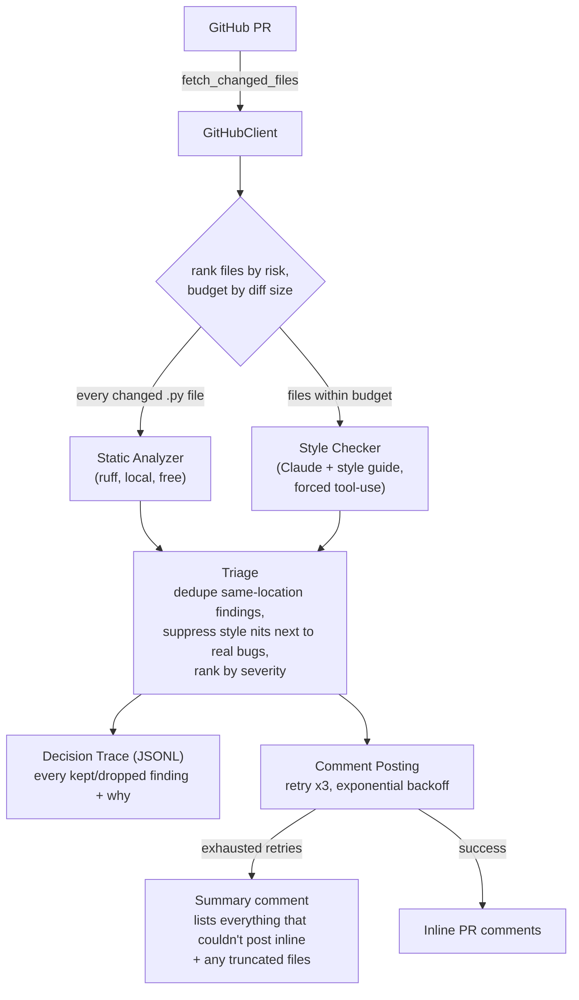

# Code Review Agent

An agentic PR reviewer that combines static analysis with an LLM-backed
style-guide check, triages the combined findings (dedupe, suppress noise
near real bugs, rank by severity), and posts the result back to GitHub.
The differentiator isn't "it posts comments" — it's a golden-set eval
harness that measures precision, recall, and false-positive rate against
known ground truth, and explicit, tested handling for every way a tool
call in the pipeline can fail.

## The problem

A PR review bot that just calls an LLM and posts whatever it says has no
way to tell you whether it's actually good — or whether last week's
prompt change made it worse. Two separate signals get conflated:
*"the tool flagged something"* and *"the tool flagged the right thing."*
This project keeps them apart on purpose: static analysis and the LLM
style checker are independent, swappable modules with a shared
`Result[T]` contract; a triage layer explains, in writing, why each
finding was kept or dropped; and a synthetic golden set with human-
reviewed ground truth is the only thing allowed to say whether a run
was good.

## Architecture



Both tools return `Result[T]` — success-with-payload or failure-with a
typed, `retriable`-flagged error — and never raise for an expected
failure (rate limit, timeout, malformed response). The decision loop is
the only place that decides what to do about a failure:

| Failure | Handling |
|---|---|
| Static analyzer times out / crashes | No retry (it's a "tool's down for this file," not a blip) — degrade that file to style-check-only, mark it `partial_review` |
| Style checker fails | Retry (bounded, exponential backoff), then that file gets no style findings, marked `style_check_failed` |
| Comment post fails | Retry (bounded, exponential backoff), then one summary comment lists everything that couldn't post inline |
| Diff too large | Rank files by risk (most static findings, then largest diff), review a budgeted prefix, name the rest explicitly in the summary comment |
| Any retriable failure | Hard-capped at 3 attempts total — nothing in this pipeline can loop indefinitely |

See [`src/agent/decision_loop.py`](src/agent/decision_loop.py) for the
orchestration and [`tests/test_decision_loop.py`](tests/test_decision_loop.py)
for a test that simulates each of these failure modes and asserts
graceful degradation.

## Layout

```
src/tools/    github_client.py, static_analyzer.py, style_checker.py — swappable, Result-returning
src/agent/    decision_loop.py, triage.py, retry.py, tracer.py — orchestration + triage reasoning
src/eval/     models.py (golden-set schema), golden_set.py (freeze/hash), metrics.py, runner.py
eval/         golden_set.candidate.json (25 cases, unreviewed), fixtures/
results/      runs/<run_id>/ (summary + per-case JSON), eval_runs.csv, traces/
```

## Running a review

```bash
export GITHUB_TOKEN=...
python -m src.agent.review --pr-url https://github.com/owner/repo/pull/123
```

Dry run by default: fetches the PR, runs the full pipeline, prints what
it found and what it *would* post — nothing is sent to GitHub. Add
`--post` to actually post. Static analysis runs against `--repo-root`
(defaults to the current directory), so this assumes you're running it
against — or with `--repo-root` pointing at — a local checkout of the
PR's head commit, the way a CI job would have one already checked out.

Illustrative output (not a captured run — see the next section for a
real one):

```
$ python -m src.agent.review --pr-url https://github.com/owner/repo/pull/123
Reviewed owner/repo#123
(dry run -- no comments posted; pass --post to post them)

src/payment.py: 1 finding(s)
  src/payment.py:14 [error] `Exception` caught and silently discarded

Posted inline: 1
Summary comment posted: True

Decision trace: results/traces/owner-repo-pr123.jsonl
```

## Eval results

**These numbers are a static-analysis-only baseline, not the project's
full claimed capability, and they are not yet official.** Two things
are true right now and both matter:

1. `eval/golden_set.candidate.json` is a **candidate** golden set — 25
   synthetic PRs I generated, not yet human-reviewed. Per this
   project's own rule (`eval/golden_set.json` is frozen only after
   review), it hasn't been frozen, and nothing scored against it is
   official until it is. `results/eval_runs.csv` records
   `golden_set_frozen: false` for this run for exactly that reason.
2. This environment has no `ANTHROPIC_API_KEY`, so the run below used a
   no-op style checker (always returns zero violations) — **only the
   static-analysis pass ran for real.** Every LLM-only case (the two
   bugs no static tool can catch by construction, most style-only
   cases) is scored as a miss below, honestly, not because the agent
   is incapable but because that half of the pipeline didn't run.

Raw output: [`results/runs/static-only-baseline/summary.json`](results/runs/static-only-baseline/summary.json),
per-case detail in [`results/runs/static-only-baseline/cases/`](results/runs/static-only-baseline/cases/).

| | case_count | recall | precision | PR-level false-positive rate |
|---|--:|--:|--:|--:|
| **Overall** | 25 | **57.1%** (8/14) | **90.0%** (9/10) | **9.1%** (1/11) |
| `real_bug` | 9 | 77.8% (7/9\*) | 100% | — |
| `style_only` | 5 | 20.0% (1/5) | 100% | — |
| `clean` | 5 | — | — | 0.0% (0/5) |
| `false_positive_trap` | 6 | — | 0.0% (0/1 flagged) | 16.7% (1/6) |

\* overall `matched_required` (8) = `real_bug`'s 7 + `style_only`'s 1.
That one `style_only` match is `style-005-wildcard-import` — a wildcard
import happens to also be a lint violation (`F403`/`F405`), so static
analysis alone catches it even though it's filed under `style_only`,
not `real_bug`. Categories describe the case, not which tool has to
catch it.

**What's missing and why, by name** (`missed_case_ids` from the run):
- `real_bug-001-off-by-one`, `real_bug-002-null-check-removed` — genuine
  gaps for *any* static linter (ruff can't reason about pagination math
  or nullability); this is exactly what the style checker's broadened
  correctness-policy guide (see [`STYLE_GUIDE.md`](STYLE_GUIDE.md)) is
  for, and it didn't run.
- `style-001` through `style-004` — naming/docstring/casing conventions
  ruff doesn't police by default and this project didn't ask it to;
  these are style-checker-only by design.

**The one false positive** (`trap-004-subprocess-but-fixed-args`): ruff's
bandit-equivalent `S607` flags *any* `subprocess.run(["git", ...])` call
regardless of whether the argument list is attacker-controlled — it
isn't here, but the rule can't tell. This is a known, real blind spot in
the ruleset this project enabled (`eval/fixtures/ruff.toml` turns on
`S`/`B`/`BLE`/`SIM`, none of which are ruff's default selection), kept in
the golden set on purpose rather than papered over.

**To get the real numbers**: review `eval/golden_set.candidate.json`
(correct `expected_findings` as needed, flip `reviewed: true` per case),
freeze it, set `ANTHROPIC_API_KEY`, and run:

```python
from src.eval.golden_set import freeze
from src.eval.runner import run_eval

freeze("eval/golden_set.candidate.json", "eval/golden_set.json")
run_eval("eval/golden_set.json", require_frozen=True)
```

`require_frozen=True` refuses to run if the frozen file's content no
longer matches its recorded hash — the enforced version of "never edit
the golden set to improve scores."

## A real trace: retry-then-fallback on a GitHub API failure

This is an actual run, not a mocked-up example — `python -m src.agent.review
--post` against a real file in this repo
([`tests/fixtures/lint_target.py`](tests/fixtures/lint_target.py)),
with a GitHub client that returns a 502 on every inline-comment attempt.
Full trace: [`results/traces/example-retry-fallback-trace.jsonl`](results/traces/example-retry-fallback-trace.jsonl)
(below with `timestamp` and null `line`/`file` fields trimmed for
readability — nothing else changed):

```json
{"stage":"static_analysis","action":"completed","reason":"1 finding(s)","file":"tests/fixtures/lint_target.py"}
{"stage":"style_check","action":"failed","reason":"style checker failed after retries (auth_failed): ANTHROPIC_API_KEY is not set","file":"tests/fixtures/lint_target.py"}
{"stage":"triage","action":"kept","reason":"static analysis finding","file":"tests/fixtures/lint_target.py","line":1}
{"stage":"comment_posting","action":"failed_inline","reason":"gave up after retries (upstream_error): 502 Bad Gateway from GitHub","file":"tests/fixtures/lint_target.py","line":1}
{"stage":"comment_posting","action":"posted_summary","reason":"1 failed-inline fallback item(s), 0 truncated file(s) noted"}
```

Walking through it:

1. **`static_analysis` / `completed`** — real ruff, run against the real
   file, found the real `F401` (`os` imported but unused).
2. **`style_check` / `failed`** — this environment has no
   `ANTHROPIC_API_KEY`; the style checker's own `Result` reports
   `auth_failed`, and the decision loop degrades that file to
   `style_check_failed` rather than crashing. (This is the second real
   failure mode this trace happens to show, for free.)
3. **`triage` / `kept`** — the one real finding survives triage (nothing
   to dedupe or suppress against).
4. **`comment_posting` / `failed_inline`** — `post_inline_comment` was
   called **3 times** (the timestamps in the raw file are ~1s and ~2s
   apart — the exponential backoff between attempts), every one
   returning a retriable `502`. After the third attempt, `call_with_retry`
   gives up: the cap is hard, not just "usually 3."
5. **`comment_posting` / `posted_summary`** — the fallback: one summary
   comment listing the finding that couldn't post inline. The CLI's own
   output for this run: `Posted inline: 0`, `Failed to post inline (see
   summary comment fallback): 1`, `Summary comment posted: True`.

## Stack

Python 3.11+, uv, `pydantic` for structured tool I/O, `requests` for
GitHub REST, `ruff` for static analysis (including its bandit- and
bugbear-equivalent rule families), the `anthropic` SDK for the style
checker.

## What I'd do next

- Finish the human review pass on the candidate golden set and freeze it
  — the numbers above are a floor, not the real result.
- Run the full eval with a real `ANTHROPIC_API_KEY` and replace the
  static-only baseline in this README with the real table.
- Grow the golden set past 25 cases, especially more `false_positive_trap`
  cases that probe the style checker specifically (right now the traps
  mostly exercise static analysis).
- `subprocess`-call rules (`S603`/`S607`) are a known source of
  false positives on this ruleset; worth deciding whether to narrow the
  selection or accept the tradeoff explicitly per-repo via config.
